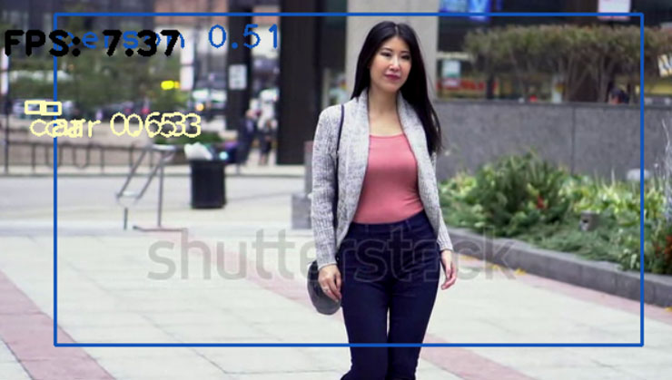

# YOLO Realtime Human Detection
YOLO Real Time Human Detection Detection (YOLO) with OpenCV and Python.

This project implements a real time human detection via video or webcam detection using yolov3-tiny algorithm. YOLO is a object detection algorithm which stand for You Only Look Once. I've implemented the algorithm from scratch in Python using pre-trained weights. YOLOv3 was published in research paper: YOLOv3: An Incremental Improvement: Joseph Redmon, Ali Farhadi It's originally implemented in YOLOv3.

COCO dataset is used for training.

## Real-Time Human Detection and Distance Estimation GUI

<table>
  <tbody>
	<tr align="center">
		<th><strong>YOLO Real-time Young Women Detection</strong></th>
	</tr>
	<tr align="center">
		<td></td>		
	</tr>
	<tr align="center">
		<th><strong>YOLO Real-time Kid Detection</strong></th>
	</tr>
	<tr align="center">
		<td></td>		
	</tr>
	<tr align="center">
		<th><strong>YOLO Real-time Fashion Women Detection</strong></th>
	</tr>
	<tr align="center">
		<td></td>		
	</tr>
</tbody>
</table>

## YOLOv3

You only look once (YOLO) is an object detection system targeted for real-time processing. We will introduce YOLO, YOLOv2 and YOLO9000 in this article. For those only interested in YOLOv3, please forward to the bottom of the article. Here is the accuracy and speed comparison provided by the YOLO web site.

## Requirement
<ul>
<li>OpenCV 4.2.0</li>
<li>Python 3.6</li>
</ul>

## Quick start
<ul>
  <li>Download official <a href="https://pjreddie.com/media/files/yolov3.weights" rel="nofollow">yolov3.weights</a> and place it under a folder called weight.</li>
  <li>Download official <a href="https://pjreddie.com/media/files/yolov3-tiny.weights" rel="nofollow">yolov3-tiny.weights</a> and place it under a folder called weight.</li>
  <li>Download <a href="https://github.com/pjreddie/darknet/blob/master/cfg/yolov3.cfg">yolov3.cfg</a> and place it under a folder called cfg.</li>
  <li>Download <a href="https://github.com/pjreddie/darknet/blob/master/cfg/yolov3-tiny.cfg">yolov3-tiny.cfg</a> and place it under a folder called cfg.</li>
</ul>

## Dependencies
<ul>
<li>opencv</li>
<li>numpy</li>
</ul>

## Install dependencies

<code>pip install numpy opencv-python</code>

## How to use?
<ol>
  <li>Clone the repository</li>
  
<code>git clone https://github.com/muhammadshiraz/YOLO-Real-Time-Object-Detection.git</code>

</ol>
<ol start="2">
  <li>Move to the directory</li>
  
<code>cd YOLO-Real-Time-Object-Detection</code>

</ol>
<ol start="3">
  <li>To view the UK Real-Time Road Detection</li>
  
<code>python real_time_yolo_detector1.py</code>

</ol>
<ol start="4">
  <li>To view the USA Real-Time Road Detection</li>
  
<code>python real_time_yolo_detector2.py</code>

</ol>
<ol start="5">
  <li>To use in real-time on webcam</li>
  
<code>python real_time_yolo_webcam.py</code>

</ol>

## Graphical User Interface:
#### A USA Real-Time Road Detection

#### A UK Real-Time Road Detection

#### A Real-Time Webcam Detection

